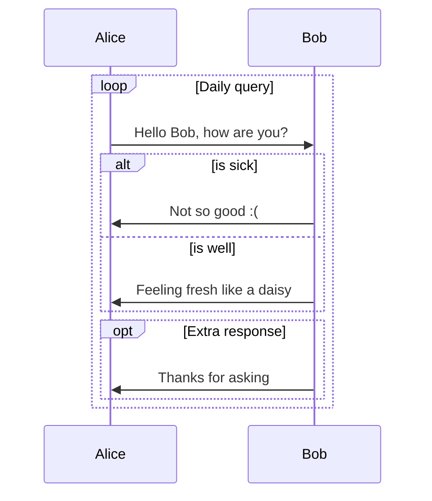

db.json 是一种常见的 JSON 格式的数据存储文件，通常用于前端开发中模拟后端数据接口的使用场景。

db.json 文件可以在项目的根目录下创建一个名为 db.json 的文件，其中存储了该数据接口所需要的各种数据，例如用户信息、文章列表等。文件格式通常如下：

```
{
  "users": [
    {
      "id": 1,
      "name": "张三",
      "age": 18
    },
    {
      "id": 2,
      "name": "李四",
      "age": 20
    }
  ],
  "articles": [
    {
      "id": 1,
      "title": "文章一",
      "content": "这是一篇文章"
    },
    {
      "id": 2,
      "title": "文章二",
      "content": "这是另外一篇文章"
    }
  ]
}
```

在前端开发中，通常使用一些框架或工具来读取 db.json 文件中的数据，并在前端页面上展示或操作这些数据，例如使用 Vue.js 框架的 Axios 库来读取 db.json 文件中的数据，并通过组件的方式将数据渲染到页面上。


++ 下划线 ++
++ 波浪线 ++{.wavy}
++ 着重点 ++{.dot}
++ 紫色下划线 ++{.primary}
++ 绿色波浪线 ++{.wavy .success}
++ 黄色着重点 ++{.dot .warning}
~~ 删除线～～
~~ 红色删除线～～{.danger}
== 荧光高亮 ==
[赤橙黄绿青蓝紫]{.rainbow}
[红色]{.red}
[粉色]{.pink}
[橙色]{.orange}
[黄色]{.yellow}
[绿色]{.green}
[靛青]{.aqua}
[蓝色]{.blue}
[紫色]{.purple}
[灰色]{.grey}
快捷键 [Ctrl]{.kbd} + [C]{.kbd .red}
H~2~0
29^th^

!! 黑幕黑幕黑幕黑幕黑幕黑幕！！： 鼠标滑过显示内容
!! 模糊模糊模糊模糊模糊模糊！！{.bulr} ： 选中文字显示内容

[default]{.label}
[primary]{.label .primary}
[info]{.label .info}
[:heavy_check_mark:success]{.label .success}
[warning]{.label .warning}
[:broken_heart:danger]{.label .danger}

{取り返す^とりかえす}


- name: "测试 1"
  url: https://cdn.kastatic.org/ka-youtube-converted/O_nY1TM2RZM.mp4/O_nY1TM2RZM.mp4#t=0
- name: "测试 2"
  url: https://cdn.kastatic.org/ka-youtube-converted/O_nY1TM2RZM.mp4/O_nY1TM2RZM.mp4#t=0
  

行内公式：$\sqrt {3x-1}+(1+x)^2$
独立块显示：
$$\begin {array}{c}
\nabla \times \vec {\mathbf {B}} -\, \frac1c\, \frac {\partial\vec {\mathbf {E}}}{\partial t} &
= \frac {4\pi}{c}\vec {\mathbf {j}}    \nabla \cdot \vec {\mathbf {E}} & = 4 \pi \rho \\
\nabla \times \vec {\mathbf {E}}\, +\, \frac1c\, \frac {\partial\vec {\mathbf {B}}}{\partial t} & = \vec {\mathbf {0}} \\
\nabla \cdot \vec {\mathbf {B}} & = 0
\end {array}$$

```mermaid
graph LR
    A [Square Rect] -- Link text --> B ((Circle))
    A --> C (Round Rect)
    B --> D {Rhombus}
    C --> D
```



